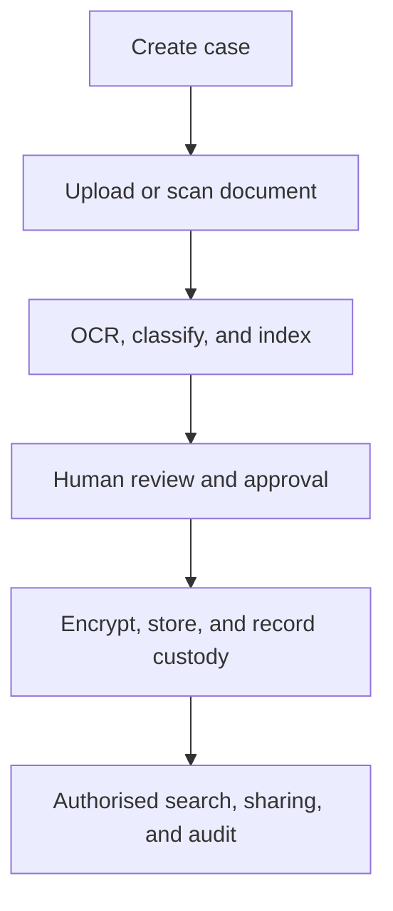

# JusticeVault

### Secure Digital Document Management System for Legal and Investigation Documents

JusticeVault is a secure, intelligent workspace for managing legal records, investigation documents, and digital evidence across police, forensic, prosecution, court, and related justice departments.

The prototype demonstrates how document intelligence, controlled access, cryptographic integrity checks, evidence-custody tracking, and tamper-evident audit records can be brought together in one case-centred workflow.

> **Prototype notice:** JusticeVault is a demonstration system. It must not be used to upload real confidential, personal, investigative, defence, or court data. Production deployment would require institutional approval, security testing, legal validation, data-governance controls, and field pilots.

## Live Prototype

**[Open JusticeVault](https://justicevaultsah.ai.studio/)**

The interface includes a security dashboard, architecture hub, case intake, document management, evidence chain, secure upload, intelligent search, approvals, audit trail, alerts, reports, users and roles, and settings modules.

## Problem

Legal and investigation records are often distributed across paper files, departmental systems, local drives, and disconnected communication channels. This creates practical difficulties:

- slow retrieval of FIRs, charge sheets, forensic reports, witness statements, evidence records, and court filings;
- weak visibility into document versions and evidence movement;
- unauthorised access and accidental disclosure of sensitive records;
- difficulty proving whether a document has changed after upload or transfer;
- fragmented coordination between police, forensic laboratories, prosecutors, courts, and other authorised institutions;
- high dependence on manual filing, copying, and physical storage.

## Proposed Solution

JusticeVault provides a centralised case workspace where authorised users can ingest, organise, verify, search, share, and audit case documents while preserving the original file and its associated metadata.

The design combines:

- **AI document intelligence** for OCR, text extraction, classification, entity identification, tagging, and indexing;
- **secure document storage** with encryption and controlled access;
- **human review** for correcting OCR output, validating metadata, and approving sensitive actions;
- **cryptographic integrity verification** using document hashes and signed events;
- **permissioned audit records** for uploads, views, exports, approvals, revisions, and custody transfers;
- **role-based collaboration** across authorised justice departments;
- **legal-record support** through evidence history and electronic-record certificate workflows.

## Core Workflow

### Five-stage ingestion pipeline

1. **Document upload or scan** – Ingest PDFs, images, and other approved evidence formats while preserving the original asset.
2. **OCR and extraction** – Extract text, tables, stamps, signatures, and relevant document structure where supported.
3. **AI classification and indexing** – Identify document type, entities, dates, locations, case references, and confidentiality metadata.
4. **Review and protection** – Allow an authorised reviewer to correct extracted information, approve tags, and apply access rules before final storage.
5. **Audit and custody tracking** – Record integrity events, access activity, approvals, signatures, and transfers in a traceable history.

## Prototype Modules

| Module | Purpose |
|---|---|
| Dashboard | Shows security status, case activity, evidence counts, approvals, alerts, and recent audit events. |
| Architecture Hub | Explains the problem, solution, five-stage workflow, benefits, and technical architecture. |
| Admin Case Ingestion | Supports multi-file case intake, verification, hashing, and electronic-record certificate flows. |
| Documents | Organises case records, versions, metadata, and document status. |
| Evidence Chain | Displays custody transitions and evidence history. |
| Secure Upload | Applies upload validation and integrity checks before processing. |
| Intelligent Search | Supports OCR-backed full-text discovery, tags, entities, and case filters. |
| Approvals | Manages pending signatures, permissions, and review actions. |
| Audit Trail | Provides chronological, tamper-evident activity history. |
| Alerts and Incidents | Surfaces integrity mismatches, unusual activity, and pending security events. |
| Reports | Supports operational and audit-oriented reporting. |
| Users and Roles | Represents role-governed access for participating departments. |

## Security Model

JusticeVault follows a zero-trust-oriented design in which access is granted according to identity, role, clearance, session context, and the requested operation.

- **Authentication:** OAuth 2.0/JWT-oriented identity flows with multifactor authentication.
- **Authorisation:** Role-based access control, clearance tiers, least privilege, and time-bounded permissions.
- **Encryption at rest:** AES-256-GCM for protected document payloads in the proposed design.
- **Encryption in transit:** TLS 1.3 for service-to-service and client-to-service communication.
- **Integrity:** SHA-256 checks for detecting changes to stored or transferred files.
- **Signatures:** Digital signatures bind an approved action to an authorised identity and timestamp.
- **Auditability:** Append-only or permissioned-ledger events record access, changes, approvals, exports, and custody transitions.
- **Upload protection:** File-type and MIME validation, malware scanning, and metadata checks are planned controls for a production implementation.
- **Sensitive data handling:** Real deployments should use approved storage locations, retention rules, key-management processes, redaction, and incident-response procedures.

Security controls shown in the prototype are architectural demonstrations and should not be interpreted as a completed security certification or guarantee of legal admissibility.

## Technology Direction

The project’s proposed implementation stack is modular and can be deployed incrementally:

| Layer | Technologies / direction |
|---|---|
| Frontend | React, Vue, Tailwind CSS |
| Backend services | Node.js and Python FastAPI |
| Database | PostgreSQL |
| Caching and queues | Redis |
| File storage | Google Cloud Storage or approved sovereign/on-premise storage |
| Identity and access | OAuth 2.0, JWT, MFA, RBAC |
| Document intelligence | OCR, multilingual extraction, classification, NER, tagging, and indexing |
| Integrity and audit | SHA-256, digital signatures, Merkle verification, permissioned blockchain records |
| Blockchain direction | Hyperledger Fabric for a permissioned evidence and audit network |
| Deployment | Docker, Kubernetes, and CI/CD through GitHub Actions |
| Testing | Jest and service-level security, integration, and workflow testing |

The prototype also illustrates concepts such as AES-GCM storage, Ed25519 signatures, hardware-backed key wrapping, IBFT-style consensus, HSM-backed key management, and hybrid cloud/on-premise storage. These components require implementation-specific threat modelling, procurement, configuration, and independent validation before operational use.

## Intended Users

- Police and investigating officers
- Forensic examiners and laboratory staff
- Public prosecutors and legal departments
- Judicial registrars, judges, and court clerks
- Cybercrime and digital-forensics teams
- Approved defence or intelligence units where applicable
- System administrators, auditors, and compliance officers

## Interoperability Direction

The architecture is intended to support API and webhook-based interoperability with existing justice and investigation systems, including CCTNS, e-Courts, e-Prisons, e-Forensics, and future ICJS-aligned services.

Integration should be introduced through approved adapters, common metadata standards, identity federation, retention policies, and institution-specific data-sharing agreements. The prototype does not claim that these integrations are already connected or production-ready.

## Legal and Governance Alignment

JusticeVault is designed with the following governance themes in mind:

- electronic-record integrity and certificate generation under the Bharatiya Sakshya Adhiniyam, 2023, including Section 63 workflows;
- investigation and procedural coordination under the Bharatiya Nagarik Suraksha Sanhita, 2023;
- risk-based cybersecurity practices aligned with NIST Cybersecurity Framework 2.0;
- privacy, purpose limitation, access control, retention, and responsible handling of personal data;
- traceable custody and human approval for evidentiary decisions.

This project is not legal advice. Actual admissibility, compliance, retention, and access requirements must be reviewed by the responsible institution and qualified legal and security professionals.

## Expected Impact and Evaluation

The intended outcomes are to make case records easier to locate, reduce repeated manual handling, strengthen document-history visibility, and improve coordination between authorised departments.

These outcomes should be measured through controlled pilots using metrics such as:

- document retrieval time;
- OCR correction rate and classification accuracy;
- completeness of custody events;
- audit-log completeness;
- integrity-verification success rate;
- approval and handover turnaround time;
- user adoption and training effort;
- storage, duplication, and paper-handling reduction.

No operational improvement should be assumed until it is validated with representative data, real users, accessibility testing, security testing, and institutional review.

## Roadmap

- Connect the prototype to a production-grade identity provider and MFA service.
- Add human-in-the-loop OCR correction and reviewer feedback loops.
- Implement policy-driven retention, archival, redaction, and legal hold controls.
- Build approved adapters for justice-sector systems and document repositories.
- Complete threat modelling, penetration testing, key-management design, and disaster recovery testing.
- Pilot the system with synthetic or officially approved data in a controlled institutional environment.
- Measure retrieval, audit, custody, accuracy, adoption, and reliability metrics before wider rollout.

## Project Information

- **Project:** JusticeVault
- **Team:** NEONIX
- **Event:** Smart India Hackathon 2026
- **Problem Statement ID:** 26190
- **Category:** Software
- **Theme:** Blockchain and Cybersecurity
- **Prototype:** [justicevaultsah.ai.studio](https://justicevaultsah.ai.studio/)

## References

- [Ministry of Law and Justice – Legislative Department](https://legislative.gov.in/)
- [NIST Cybersecurity Framework 2.0](https://nvlpubs.nist.gov/)
- [Hyperledger Fabric Documentation](https://hyperledger-fabric.readthedocs.io/)
- [Microservices Architecture – Martin Fowler](https://martinfowler.com/articles/microservices.html)

## Licence

No open-source licence has been declared for this prototype. Contact Team NEONIX before reusing project assets, source code, branding, or documentation.
